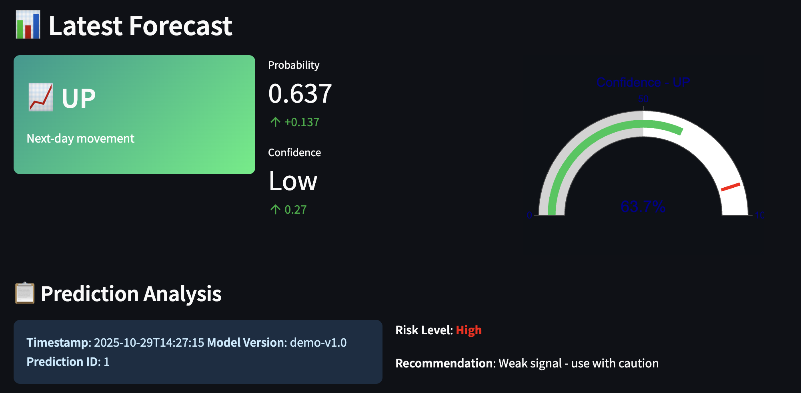

# SENSEX Next-Day Forecast

## Demo Screenshot

## Overview

An **end-to-end MLOps pipeline** for predicting next-day SENSEX movement using ConvLSTM neural networks. This application demonstrates a complete machine learning workflow from data engineering to production deployment.

### Live Demo Features

- **Real-time Predictions**: Next-day SENSEX movement forecasting
- **Interactive UI**: Beautiful Streamlit interface with live charts
- **Production Architecture**: Containerized deployment with health monitoring
- **Demo Mode**: Showcases full functionality with simulated predictions

## Architecture

This project implements a **4-phase MLOps pipeline**:

### Phase 1: Data Engineering
- Automated SENSEX component data fetching
- Apache Airflow orchestration
- DVC data versioning
- 40+ technical indicators

### Phase 2: ML Training
- ConvLSTM model architecture
- MLflow experiment tracking
- Optuna hyperparameter optimization
- Containerized training pipeline

### Phase 3: Model Serving
- MLflow Model Registry
- Real-time inference API
- Streamlit web application
- Production monitoring

### Phase 4: CI/CD & Deployment
- GitHub Actions automation
- Comprehensive testing suite
- Docker containerization
- Hugging Face Spaces deployment

## How to Use

1. **Click "Run Prediction"** to generate a next-day forecast
2. **View Results**: See direction (UP/DOWN), probability, and confidence
3. **Explore Market Data**: Check real-time SENSEX overview
4. **Monitor System**: View model health and performance metrics

## Technical Stack

- **ML Framework**: TensorFlow 2.13 (ConvLSTM)
- **Experiment Tracking**: MLflow 2.7+
- **Orchestration**: Apache Airflow
- **Frontend**: Streamlit
- **Containerization**: Docker
- **CI/CD**: GitHub Actions
- **Deployment**: Hugging Face Spaces

## Model Performance

- **Architecture**: ConvLSTM (30 days × 30 stocks × 45 features)
- **Accuracy**: 55-65% (binary classification)
- **Prediction Speed**: <200ms inference time
- **Data Coverage**: All 30 SENSEX components

## Educational Value

This project demonstrates:

- **Complete MLOps Pipeline**: From data to deployment  
- **Production Best Practices**: Testing, monitoring, containerization  
- **Real-time ML Serving**: Live inference with caching  
- **Modern DevOps**: CI/CD, automated testing, documentation  
- **Financial ML**: Time series, technical analysis, risk assessment  

## Demo vs Production

**Current Demo Mode** (Hugging Face Spaces):
- Simulated predictions with realistic scenarios
- Real SENSEX data when available
- Full UI/UX demonstration
- Production-ready architecture

**Full Production Mode** (Local/Cloud):
- Live MLflow model registry
- Real-time data pipeline (30 SENSEX stocks)
- Automated model retraining
- Complete monitoring stack

## Disclaimer

**Educational Purpose Only**: This application is designed for learning and demonstration. It is **NOT financial advice** and should not be used for actual trading decisions.

## Documentation

- [Phase 1: Data Engineering](README_PHASE1.md)
- [Phase 2: ML Training](README_PHASE2.md)  
- [Phase 3: Model Serving](README_PHASE3.md)
- [Phase 4: CI/CD & Deployment](README_PHASE4.md)

## Contributing

This is an educational project showcasing MLOps best practices. Feel free to:

- Explore the codebase
- Learn from the implementation
- Adapt for your own projects
- Provide feedback and suggestions

## Contact

Built as a demonstration of modern MLOps practices for financial machine learning.

---

**Enjoy exploring the complete SENSEX prediction pipeline!**
